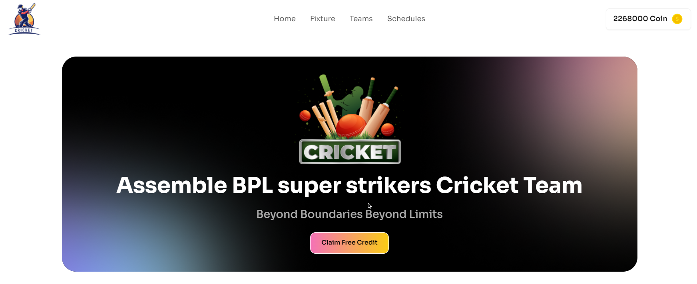

# BPL-Super-Strikers

Here i make a reactJs based website. First of all you can add players in the selected section by clicking the choose player button. But you must need add some amount of money for adding the players. If there is less money in coin button you can't add players and it will show a pop-up message. You can't add more than 6 players. After adding the players you also can remove the player by clicking the bin button. 

## Website-view

## Live-Link

[BPL-Super-Strikers](https://bpl-super-strikers-36.surge.sh/)

## Uses Technologies 

- ReactJS
- Tailwind
- DaisyUI
- Reat Toastify
- Reat Proptypes

## 3 key features 

- Adding money 
- Adding players 
- Remove players

